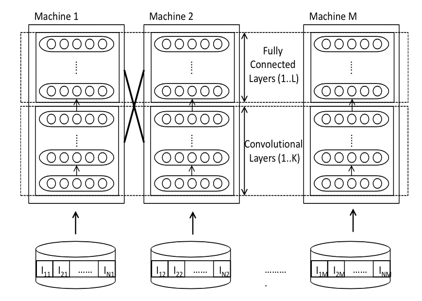
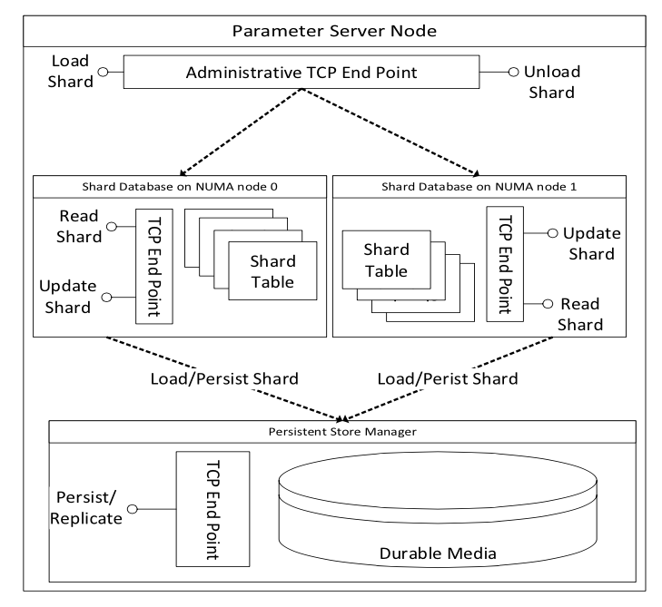
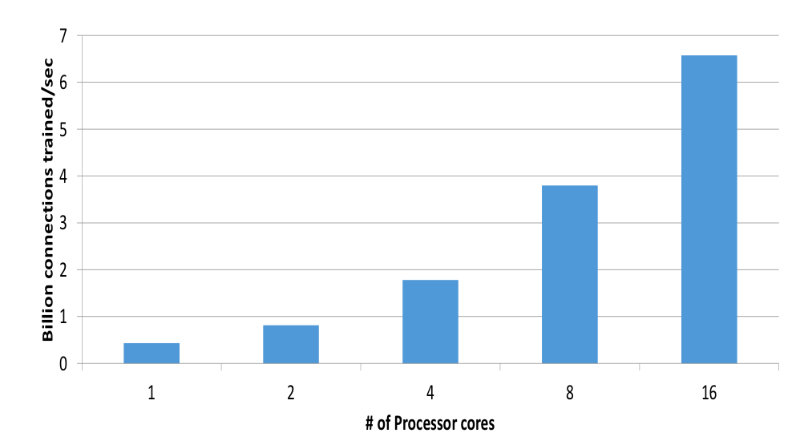
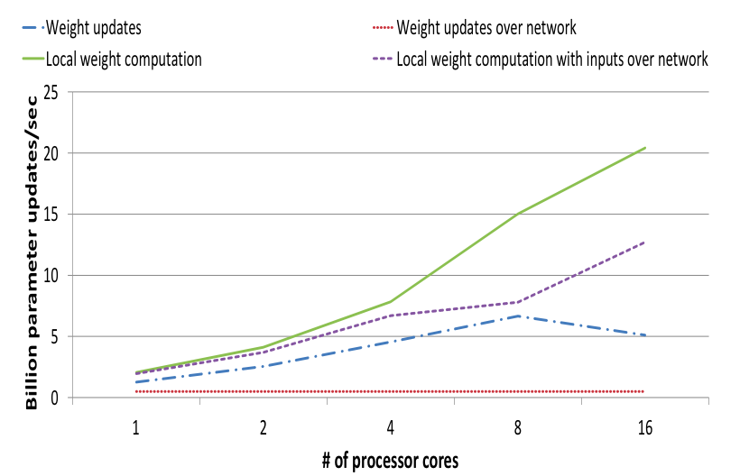
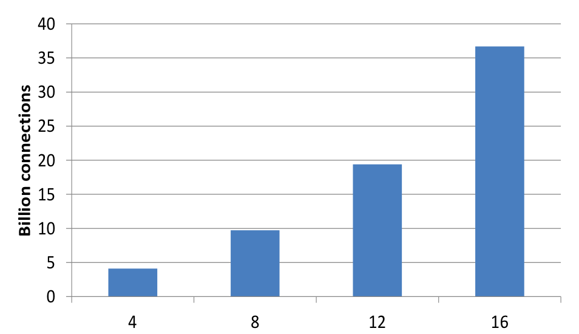
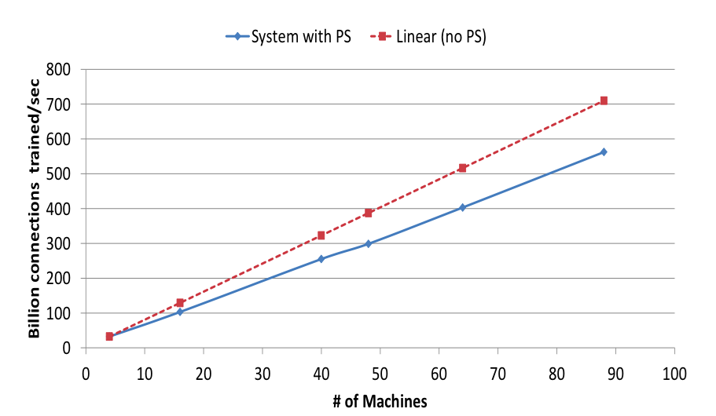
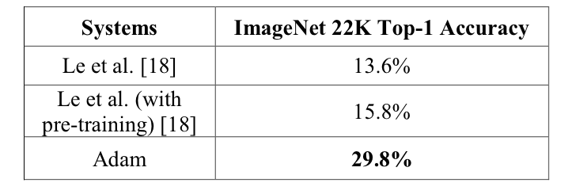
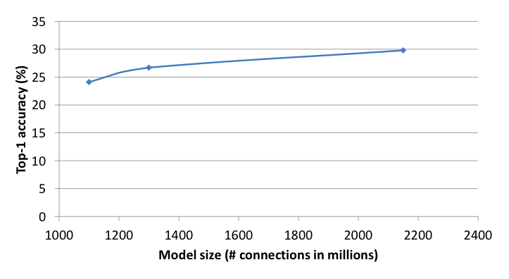

# Adam：大规模分布式机器学习框架

# 引子

又是好久没写博客，记得有一次看Ng大神的访谈录，如果每周读三篇论文，那么经年以后，必然成为对某个领域非常熟悉的人。

可惜，在忙忙碌碌中，我竟然做不到这一点。但是，我目前的打算是尽心尽力的去做，哪怕一周只读一篇呢。胡适先生曾说过：“怕什么真理无穷，进一步有进一步的欢喜”。然而，这其中的区别在于，我还没有达到追求真理的高度，我就是想看看这个技术是咋子回事塞。

我想，对于很多像我这样非科班出身自己学ML的人来说，肯定有很多时候感觉自己对ML的理论推导之类的事情捉襟见肘，虽然很多时候想下狠心自己去恶补一下数学啥的，然而却并没有什么卵用。不得不承认，有些东西还是得有人指点才能一步一步扎实的往下学，自己无头苍蝇般瞎学很快便会耗尽精力与热情，我想这恐怕就是读博的必要性了吧。

然而对于只想安静的做一个程序员的我来说，换一个角度思考一下，如果要做一个出色的程序员的话，其实过多的理论恐怕也是不需要的，多了解一些算法的实现或许更有好处。所以，我觉得本片博客更偏向于实用，因为它并非在理论上做了大的改进而提高的效果，而是一个分布式机器学习算法的实现。

# Adam

关于Adam的报道，参见[3].

本片博客是阅读论文所得的笔记，论文中得配图均来自与论文，论文名称见参考文献[1].

Adam是微软研究院的深度学习项目，该项目仍然是应用卷积神经网络进行图像分类，效果提高了很多，但从我读论文的角度看，adam更偏向于分布式框架的实现，而非理论的创新，自Alex和Hinton在2012年发出[2]以后，其实卷积神经网络的核心并没有大改，然而将卷积神经网络从学术界引领到工业界，我觉得adam的贡献匪浅。

那么，为什么需要adam这样的框架呢？

1. 机器学习方法一箩筐，但只有卷积神经网络可以hold住图像，因为图像语音类的数据太难提取特征所致。
2. 卷积神经网络早就出现，为何现在才发挥威力，主要得益与计算能力的提升。
3. 要想得到好效果，想在的计算能力还不够，必须得大数据+大模型才好，所以为了解决大模型日益增长的计算能力需求和现在挫挫的计算机之间的矛盾，adam横空出世，没有条件创造条件也要上，把数十上百台机器有效的连接起来，形成强大的计算能力。

ok，话不多说，软话说完，开始说技术吧，如有纰漏，还望指正。

# Architecture

Adam框架仍然基于Multi-Spert架构，这个架构的大体含义就是将集群分为如下几个部分：

1. 数据服务类。存储数据，数据备份。向计算节点提供数据。
2. 训练模型类。训练模型，然后更新参数。
3. 参数服务器。维护一个共享的模型，计算节点计算完成后，可以向参数服务器发送请求更新参数。

# Data Serving

有专门的服务器用作提供数据，这些服务器在提供数据的同时还会提前对图像做一些变换（反转、倾斜等）。

在提供数据的时候，使用预载入内存的方式进行加速，使用后台进程进行异步I/O把将被访问的图像预先成批载入进内存，使得将被访问的图像一直处于内存中。

# Model Training

adam训练的仍然是Alex提出的那个模型，五个卷积层搭配三个全连接层。在adam中，将这些模型垂直切分。如下所示：

## Multi-threaded Training

单台机器上的模型都是多线程训练的，这些线程共享一个模型参数。

在运行过程中，每个线程被分配不同的图片进行训练。

然而每个线程的上下文的运算环境（包括正向计算和反向传播）都是单独的，上下文运算环境被预先分配好来防止堆锁。

上下文环境和每个线程的中间结果的缓存都使用NUMA-aware分配空间来减少cross-memory bus traffic。

## Fast Weight Updates

为了加速训练，对共享的模型参数的局部更新是不加锁的。每个线程都计算权重更新值然后直接更新模型。

当然，这会导致不一致性，但实验证明，这样的更新方式仍然可以收敛。

收敛的原因可能是因为神经网络的弹性可以hold住这样的不一致所带来的噪声。后面还会提到，可能正是因为这样的噪声，使得模型的泛化能力更加强大。

## Reducing Memory Copies

因为模型的数据需要在层与层之间传递，而模型又是被切分的，故而很多数据的传送是非本地的。

对于本地传送，传递指针而非值。

对于非本地传送，构建了基于windows socket API的网络库，加速数据传送，具体信息不详。

使用了静态模型切分来优化模型间需要传递的信息量。（静态模型切分是啥？）

使用引用计数来保证异步网络IO的安全性。

## Memory System Optimization

对模型进行切分，直到单次训练的内存可以Fit到L3缓存中。 L3缓存比主存在浮点数单元上的使用上更不受内存带宽的影响。

前向计算和反向传播的计算都有很好的计算上的局部性需求，因而，将数据打包然后使用矩阵运算更容易利用局部性和浮点计算单元。

## Mitigating the Impact of Slow Machines

即便机器的配置是一样的，在模型运算过程中仍然会有快慢之分。

为了避免快机器上的线程被慢机器上的线程拖累，允许线程并行的处理多张图像，使用一个数据流框架，当数据到来时，触发一张图像上的处理流程。

每次迭代结束的时候，往往需要等待所有图像都处理完然后再在验证集上计算错误率再决定下次迭代是否需要。然而这就麻烦了，需要等待最慢的机器也跑完。故而，设计了一种策略，在75%的图像处理完之后，就开始评测模型，并觉决定是否有下次迭代。在75%设定之后，使用随机化方法保证同样的集合下次不能被跳过。这种策略可以加速20%以上。

## Parameter Server Communication

设计了两种模型更新方法：

- 本地计算参数更新值，当处理k张图像后，向parameter server发送更新请求，然后parameter server直接更新参数。这种方法对卷积层比较适合，因为卷积层的参数有很多都是共享的。对于全连接层，有太多的权重需要更新了，这种方式消耗太大。需要采用下面的方法。
- 与其传送参数更新，不如传送激活值和错误梯度向量，然后激活值和错误梯度向量在parameter server上进行矩阵计算得到权重更新。这样就将M×N的数据传送量变为k×(M+N)，这样做的第二个好处就是将有些计算搬到parameter server上来，增强了系统的平衡性。

# Global Parameter Server

Parameter Server的架构如下，这是一个标准的传统分布式的k-v存储结构，但是对于要训练卷积神经网络来说，参数的更新速度太快了，还需要优化。

## Throughput Optimizations

模型的参数被切分成1M大小的shards，这些shards被哈希到不同的存储桶中，然后平均的分到各个参数服务器中。这样的方法增加了空间局部性，更新时也易于负载均衡。

批量更新参数。有益于局部性，缓解了L3的压力。

参数服务器使用SSE/AVX指令。所有的处理都是NUMA aware。（这条我并不清楚说的是啥，和硬件相关）。

使用无锁的队列结构和哈希表结构来加速网络传输、更新和硬盘IO处理。

通过内存池实现了无锁内存分配。

## Delayed Persistence

为了增大吞吐量，将持久化从更新过程中去耦合划分出来。参数存储被建模成为一个回写缓存，脏数据块被后台异步的回写回去。

部分的数据丢失也是可容忍的，因为DNN模型有弹性嘛。然而，对于丢失的数据，很容易可以重新训练出来。

延迟持久化还可以允许压缩回写，由于参数更新的可加性，缓存更新很多轮后，才有一次回写也是可以的。

## Fault Tolerant Operation

每个参数都是三份缓存。这些参数服务器的分配信息保存在一个参数服务器控制器的机器上。控制器和参数服务器通过心跳同步。

在参数更新时，备份服务器和主服务器通过心跳同步。

当有一台机器丢失心跳后，控制器重新选择主服务器。

# Evaluation

在ImageNet所有的22000个类上进行实验，使用top-1准确率进行评估。

## Model Training

在没有参数服务器的情况下，训练模型，看看每秒钟可以训练多少链接。可以看到，加速比是超线性的，因为机器越多，内存越大，数据在内存中，自然快。

## Parameter Server

加上参数服务器后，再看看加速比情况。可以发现，加速比比纯本地计算要少，但克服了8机器时的权重更新方法遇到的瓶颈。

## Scaling with more workers

将用于训练的机器增多，查看加速比。用于训练的机器增多，保证每台机器上的参数数目不变，增大模型大小，从而机器数目增多，但由图可见，网络上的通信并未影响加速。

## Scaling with more Replicas

模型大小不变，但增大参数的副本数目，也就是说，数据的并行化变大了。看看加速情况。

## performance

效果如下，提升大大滴。随着模型变大，效果也变得越好。

# 总结

论文的主要贡献：

1. 通过设计系统，优化和平衡计算和通信。最小化分布式模型的内存带宽使用和机器间的通信。
2. 利用机器学习训练过程对不一致性的容忍，提高效果和集群扩展性。使用多线程模型、无锁更新、异步批量更新技术等提高可扩展性。另外，异步训练也有助于提高算法效果。
3. 证明了系统性能、可扩展性和异步训练都有助于提高模型准确率。使用少于30台机器训练了一个20亿连接的模型，在ImageNet的22000类数据上达到两倍于之前的准确率，数据足够的情况下，模型越大，效果越好。

# 参考资料

[1]. Chilimbi T, Suzue Y, Apacible J, et al. Project adam: Building an efficient and scalable deep learning training system[C]//11th USENIX Symposium on Operating Systems Design and Implementation (OSDI 14). 2014: 571-582.

[2]. Krizhevsky A, Sutskever I, Hinton G E. Imagenet classification with deep convolutional neural networks[C]//Advances in neural information processing systems. 2012: 1097-1105.

[3]. http://www.tuicool.com/articles/IbAZFb