# Learning to Rank简介

机器学习有三大问题，分类、回归和排序。分类和回归之前了解了很多的算法，但排序还没有深入的了解过。

`Learning to Rank`有很多种典型的应用。包括：

- document retrieval
- expert search
- definition search
- collaborative filtering
- question answering
- keyphrase extraction
- document summarization
- machine translation

这一长串下来，想必重要性不言而喻。话不多说，开始正题。

# 基本定义

了解一个算法，要从它的目标和数据开始。Ranking的基本流程如下：

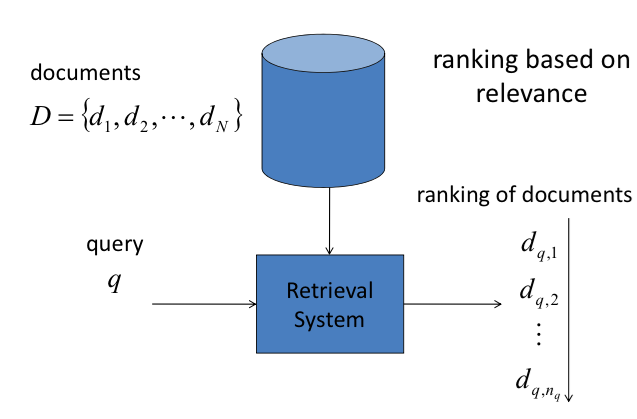

给定一个query，得到一批文档。优化的目标自然就是相关性越高的文档排在前面越好。那么如何量化这个指标呢？有三种函数可以量化这个指标：

- DCG（Discount Cumulative Gain）
- NDCG（Normalized Discount Cumulaive Gain）
- MAP (Mean Average Precision)

先从DCG开始说，对于查询到的每一个样本来说，标注好的数据中它都会有一个评分，该评分也相当于类别，这个评分越高，表明这个样本越相关。DCG的基本思想就是排名越高的结果越相关那么DCG值就会越大。

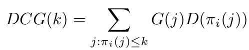

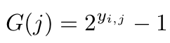

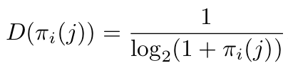

DCG的公式表示，对于每次查询得到的结果排列，对于前k个结果中的每一个样本，计算一个总评分，该评分由两项相乘得到，G(j)与相关性有关，相关性越大，G(j)越大，而且是以指数级增长；D(pi(j))则和位置有关，位置越靠前，就越重要，以对数的倒数形式衰减。

NDCG是归一化后的DCG，它表示的是，对DCG进行归一化，使得相关性排序正好从高到低时，值为1。所以在此不赘述了

下面说说MAP，如下：

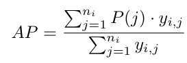

需要注意的是，MAP中，结果只有相关和不相关两种，即1和0。
P(j)表示，到位置j时，前j个结果中有多少相关的结果的比率。而AP的定义则表示，所有相关结果位置上的准确率的平均。而MAP则是，所有样本上AP值的平均。

在具体的算法中，上述的指标是无法直接优化的，只能采用各种各样的妥协，比如：

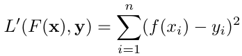

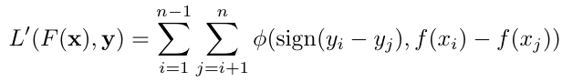

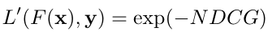

这三种都是1-NDCG的upper bound函数（这里我还没明白）。但这三种则代表了不同类型的妥协，第一种是pointwise的，因为在单个样本上计算损失。第二种是pairwise的，在成对的样本上计算损失。第三种是listwise的，因为直接在list上计算损失。

# Pointwise方法

Pointwise方法包括：

- Subset Ranking
- McRank
- Prank
- OC SVM

以OC SVM为例，她是传统SVM的变形，通过增多偏移量的方式，实现多个分类面，从而达到分类的目的。

以最简单的线性分类器来看，传统的SVM计算分类面的方式是w·x+b，而OC SVM则是有多个b，从而构造了多个平行的分类面，如下所示：

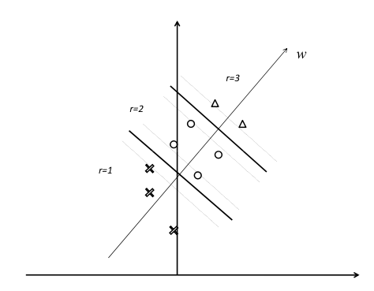

反映在目标函数上就是：

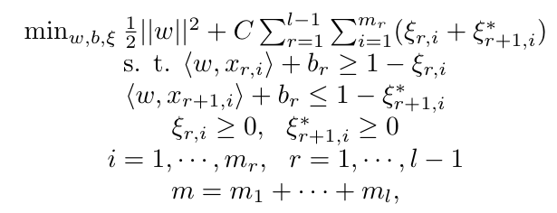

# Pairwise方法

pairwise方法包括：

- Ranking SVM
- RankBoost
- RankNet
- GBRank
- IR SVM
- Lambda Rank
- LambdaMART

## Ranking SVM

通过把问题简化，变成判断两个样本先后的二分类问题：

反映在目标函数上就是：

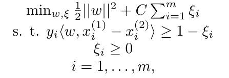

## IR SVM

Ranking SVM的简化方法导致该算法具有两个缺点：

- 没有区分不同相关性文档的重要程度
- 没有区分不同query间pair对的重要程度

为了解决这两个问题，对Hinge Loss做出了改进，对不同类型的pair进行加权。

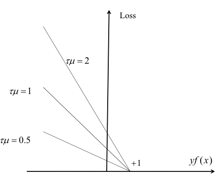

反映在目标函数上就是：

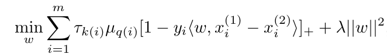

加权的两个函数一个用来衡量不同相关性的样例，一个用来衡量不同query的样例。而加权的方法是采用先验方法来做。对于不同相关性的文档，要根据其相关性值来确定函数，对于不同query，根据该query产生的pair对的数目的倒数来加权。

# Listwise方法

Listwise方法包括：

- ListNet
- ListMLE
- AdaRank
- SVM MAP
- SoftRank

以SVM MAP为例，对于一个query，查询到的样本会形成一个排列，该排列的得分可以用如下函数衡量：

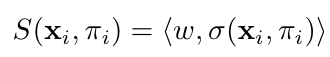

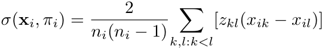

而真正要优化的额函数，如下：

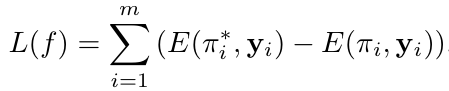

其中，E可以是NDCG或MAP。

对上面的函数进行转化，取它的upper bound。如下：

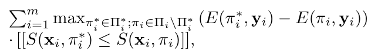

这里是upper_bound的原因是因为后面那个被乘项要么是负，要么是零。由此，本来该求最小值，也变成了求最大值。

然后还是不能继续优化，所以还得再做两个变换。

- 将0-1（不等号）函数转化：

- 因为 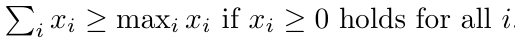

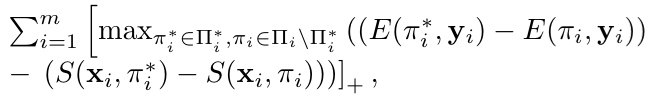

从而，问题就转化成了如下：

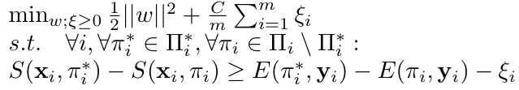

这样就变为了可以优化的问题。

# 未来的研究方向

- training data creation
- semi-supervised learning and active learning
- feature learning
- scalable and efficient training
- domain adaption and multi-task learning
- ranking by ensembel learning
- global ranking
- ranking of nodes in a graph

# 参考文献

[1]. Hang L I. A short introduction to learning to rank[J]. IEICE TRANSACTIONS on Information and Systems, 2011, 94(10): 1854-1862.

