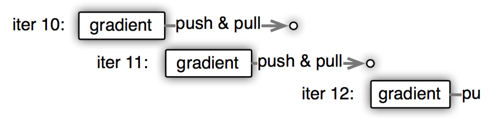
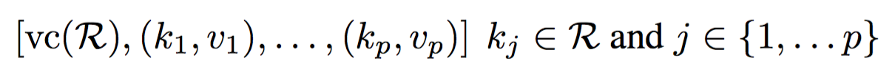

# Parameter Server架构

现在的机器学习系统，但凡是大一点的公司，恐怕都在用分布式了。而在分布式机器学习领域，最出名的恐怕就是少帅的PS框架了。在本博文里，PS框架特指第三代PS框架，即少帅的PS框架，PS框架在本文里有和分布式机器学习框架等同的意义。

本片博客是论文笔记性质，特此声明。

现在的大数据机器学习系统，通常数据在1TB到1PB之间，参数范围在109和1012左右。再这样的量级下，如果想进行分布式，那么很多算法的参数只能采用分布式存储。从而，产生了三个挑战。

- 访问这些参数需要很大的网络带宽
- 很多算法是序列性的，同步会影响性能
- 在大规模分布式下，错误容忍是很重要的。

从而，就诞生了各种各样的分布式机器学习系统，

# 笑傲江湖

世界上本没有路，走的人多了，路也渐渐开阔起来。分布式机器学习系统的第一代架构，恐怕可以追溯到[2]，但那个时候，有一种先帝创业未半的感觉，那个系统使用memcached，一个分布式的kv数据库，来做同步机制，因而很缺乏扩展性，性能也不强。

于是YahooLDA，作为第二代的分布式架构，就出现了。它使用一个更规范的负载分布算法和一个专有的服务器，该服务器有自定义好的一些基础单元，get/set/update等。同样的设计在Distbelief也可以见到。

对第二代分布式架构做改进的初步尝试是Petuun，他使用一个有限制的延迟模型，同时在工作线程模型上添加更多限制。

PS框架属于第三代框架，它基于之前的基础做了更多的优化，同时也采用了各家之长。

- 比如基于Hadoop的Mahout，基于Spark的MLI，这俩都是迭代式的Map-Reduce框架，而Spark和MLI的模式是保存算法运行的中间状态，这也正是PS框架要做的。
- 分布式GraphLab使用基于图抽象的异步通信，使得通信效率大大增强。但相对于Map-Reduce框架来说，它缺少弹性，同时依赖于粗粒度的快照来做恢复，这两点使得它的可扩展性很差。
- Piccolo，使用同PS框架类似的机制来操作的。工作节点在本地预先聚合一些状态，然后将其上传到服务器节点。但是相对于PS框架来说缺少了一些针对机器学习的优化，比如，消息压缩、备份和通过图依赖达到的变量一致性模型。

> 所有的设计都有一个渐变的过程，不是一开始就能看到最好的设计，一定是根据事态的发展，一步一步走到今天的程度。我第一次看到PS的设计的时候，觉得这是很自然的设计，就如它本该是这样一样，但看的多了，才知道之前已经有那么多了。

> 就跟我们看到的这个社会，我们生活的这个年代是这样子的，有很多事情我们认为是理所当然的，但它也是一步一步发展成这样的。再比如我们的父母同学朋友，他们经常和我们有不一样的看法，是怎样的环境和生活体验才能让他们有这样的看法，我觉得挺好奇。

> 我觉得生活就是不停的好奇和探索，包括上时间上的，追寻过往和未来；包括人格上的，追寻外在和内在；又包括空间上的，追寻不同的风土人情。

> 扯远了！

# Parameter-Server

说了那么久的PS，仍然有一种PS是啥的疑惑，请看下图。

PS架构包括内功和外功两个部分，所谓的外功，就是把计算资源分为两个部分，参数服务器节点和工作节点：

- 参数服务器节点用来存储参数，
- 工作节点部分用来做算法的训练。

内功就是对应的，把机器学习算法也分成两个方面，即参数和训练。

- 参数部分即模型本身，有一致性的要求，参数服务器也可以是一个集群，对于大型的算法，比如DNN，CNN，参数上亿的时候，自然需要一个集群来存储这么多的参数，因而，参数服务器也是需要调度的。
- 训练部分自然是并行的，不然无法体现分布式机器学习的优势。因为参数服务器的存在，每个计算节点在拿到新的batch数据之后，都要从参数服务器上取下最新的参数，然后计算梯度，再将梯度更新回参数服务器。

> 上图让我想起了Hadoop的架构图，hadoop包括调度节点和工作节点，上图看起来似乎是将两个Hadoop连接起来，只不过其中有一个是参数服务器。PS的设计完全突破了Hadoop针对迭代式算法的限制，对于大型模型来说，在PS架构上，既能利用Hadoop架构的伸缩性和扩展性，又可以看做是把所有中间状态都放在内存里的样子。

> PS这样的架构，从发展的timeline上我认为是呼之欲出的，我觉得PS架构的贡献一是在于针对算法的抽象，而更多的是具体实现细节上的改进，所谓工匠精神，我觉得是做架构的工程师们的精华所在。有些人有很多好的idea，但就是细节上出的各种小毛病，导致各种榜就是刷不上去，呜呼哀哉。对我来说，自己的定位是一个工程师，那么工匠的精神和能力应该是下一步要奋斗的目标。

> 又扯远了！

这种设计有两种好处：

- 通过将机器学习系统的共同之处模块化，算法实现代码更加简洁。
- 作为一个系统级别共享平台优化方法，PS结构能够支持很多种算法。

从而，PS架构有五个特点：

- 高效的通信：异步通信不会拖慢计算
- 弹性一致：将模型一致这个条件放宽松，允许在算法收敛速度和系统性能之间做平衡。
- 扩展性强：增加节点无需重启网络
- 错误容忍：机器错误恢复时间短，Vector Clock容许网络错误
- 易用性： 全局共享的参数使用向量和矩阵表示，而这些又可以用高性能多线程库进行优化。

还有一个特点就是，上述架构图中，worker也划分了group，这样做的作用是使得PS可以支持多任务的并行运算，比如，可以有一个group是线上服务的，有一个是线下训练的，这样，线上服务就可以无缝直接利用线下训练的结果了。当然，还有一个逻辑上的命名空间的概念，不同的work group可以在同一个命名空间下，这样，多个work group就可以为同一个任务服务了。

 
# 工程难点

PS架构设计挺好，但实现方面的工作也是大问题，在具体的工程中，会遇到如下问题：

- 通信，每个kv都是都是很小的值，如果对每个key都发送一次请求，那么服务器会不堪重负。为了解决这个问题，可以考虑利用机器学习算法中参数的数学特点（即参数一般为矩阵或者向量），将很多参数打包到一起进行更新。
- 错误容忍，长时间计算最怕的就是任务中间重启。所以，节点失效和自我修复是系统架构要解决的问题。解决了这个问题，那么集群的动态调整目标也可以达到。

# 机器学习算法

有监督的机器学习算法一般会有三大因素，目标、参数和参数更新方法。所谓的目标就是去拟合数据，比如广告点击预测就是预测出是否点击，需要让其尽量接近真实情况。参数就是模型，模型的复杂度和数据量的大小的关系是非常有意思的，参数很多，模型很复杂，能够学习到更深入的模式，但却容易过拟合；模型太简单又容易学习不到数据中的模式。而更新方法就是处理数据得到模型，通常出了梯度下降以外，还需要加上正则化项，梯度下降得到参数的更新，正则化项防止模型过拟合。

> 至于正则化项为什么能防止过拟合？ 我还需要好好了解一下。

而对于无监督或半监督的机器学习算法，需要从没有标注的数据中学习到模式，比如LDA。

但神奇的是，两种不同类型的机器学习算法都可以应用PS架构，并且很容易扩展。

# PS架构下生活的程序

最直接的程序如下，称之为算法1吧。

它在架构下的流程如下：

还有一个算法，称之为算法3。

算法1是最直接的算法，流程就如上面提到的那样，从参数服务器上获取参数，计算梯度，把参数在发给参数服务器更新。

算法3则是优化后的算法，具体的优化点下面会讲到。

# PS的特点

## key-value vectors

如果每一个参数都设一个key，那么会使得通信变得非常频繁低效，为了抹平这个问题，就开始有折衷了。
利用机器学习算法的特性，赋予每个key所对应的value向量概念或者矩阵概念。

做这样的操作的前提是假设参数是有顺序的。缺点是在对于稀疏模型来说，总会在向量或者矩阵里会有参数为0，这在单个参数状态下是不用存的，所以，造成了数据的冗余。

但这样做有两点好处：

- 降低网络通信
- 使得向量层面的操作变得可行，从而很多线性库的优化特性可以利用的上，比如BLAS、LAPACK、ATLAS等。

## Range Push and Pull

当参数的存储是向量或矩阵形式的时候，那么网络通信自然而然也应该做这样的调整。在算法3中应用了区间更新这样的形式。

## User-Defined Functions on the Server

在算法1中，服务器端更新参数的时候还要计算正则化项。这样的操作可以由用户自定义指定。同时，这样的自定义函数还可以扩展到和参数同key的数据上，比如梯度g，可以将梯度g作为自定义函数的参数穿进去更新参数，这样，服务器端也不用存梯度变量了，节省了内存。

## Asynchronous Tasks and Dependency

参数服务器和工作节点之间的通信都属于远程调用，那么，远程调用是比较耗时的行为，如果每次都保持同步的话，那么训练相对于单节点来说是减慢了许多的，因为远程调用的耗时。因而，PS框架让远程调用成为一部调用，比如参数的push和pull发出之后，立即使用当前值开始进行下一步的梯度计算，如上图，迭代11发出push和pull的请求后，立马开始进行梯度计算，而此时，使用的还是迭代10的值。

这其实也是一种折衷，失去了模型的一致性，提升了速度。

## Flexible Consistency

既然上面也提到了一致性。为了让用户更好的控制模型的一致性，PS架构允许用户定义一致性。提供了三种可能的方法：

- Sequential 序列式的，即完全同步的
- Eventual 完全不同步的
- Bounded Delay 有条件的限制，可以允许用户在限制的次数内异步，不如限制为三次，如果某个节点已经超前了其他节点四次迭代了，那么要停下等待同步。需要注意的是，在整个训练过程中，Delay可能是动态的，即delay的参数在训练的过程中可以变大或者变小。

## User-defined Filters

作为上述特点的补充，PS还有这样一个小feature，即过滤，在工作节点这一端对梯度进行过滤，如果梯度并不是那么影响重大，就不用占用网络去更新。比如算法3中的KKT

# PS的实现

在PS的实现层面，又有很多的细节。这些细节有很多都是利用系统的特性想出来的。

## Vector Clock

为参数服务器中的每个参数添加一个时间戳，来跟踪参数的更新和防止重复发送数据。基于此，通信中的梯度更新数据中也应该有时间戳，防止重复更新。

如果每个参数都有一个时间戳，那么参数众多，时间戳也众多。但借助于Vector概念，很多的参数可以作为向量存在k-v中，因而，时间戳的数量大大减少。

在刚开始的时候，所有的参数都是一个大向量，时间戳为0，每次来一个范围的更新，如果能找到对应的key，那么直接更新那个key的时间戳就可以了。否则，就可能会对某些向量进行切分，好在，来一次更新请求，最多能把一个区间切分为三个区间，如算法2所示：

## message

通信过程中，通信的数据格式一般如下：

在这个过程中，有两个优化点：

- 因为对于每个工作节点来说，所存储的数据是一定的，因而传输用的key list可能会重复的，所以，可以针对key list做cache，在传输的时候减小数据量
- 对于稀疏模型来说，可能一个key range下会有很多参数更新是0，那么可以对数据进行压缩，PS架构使用了Snappy compression library来压缩0值。

## 一致性hash

参数服务器集群中每个节点都负责不同区域的参数，那么，类似于hash table，使用hash ring进行实现，key和server id都插入到hash ring上去。如下所示：

在hash ring分配的节点，称为该range的master节点。
hash ring存放在server manager节点上。

## 备份和一致性

使用类似hadoop的chain备份方式，对于一个master节点，如果有更新，先更新它，然后再去更新备份的服务器。

在更新的时候，由于机器学习算法的特点，可以将多次梯度聚合之后再去更新备份服务器，从而减少带宽。

## Server Management

由于key的range特性，当参数服务器集群中增加一个节点时，步骤如下：

- server manager节点给新节点分配一个key range，这可能会导致其他节点上的key range切分
- 新节点从其他节点上将属于它的key range数据取过来，然后也将slave信息取过来
- server manager广播节点变动，其他节点得知消息后将不属于自己key range的数据删掉

在第二步，从其他节点上取数据的时候，其他节点上的操作也分为两步，第一是拷贝数据，这可能也会导致key range的切分。第二是不再接受和这些数据有关的消息，而是进行转发，转发到新节点。

在第三步，收到广播信息后，节点会删除对应区间的数据，然后，扫描所有的和R有关发送出去的还没收到回复的消息，当这些消息回复时，转发到新节点。

节点的离开与节点的加入类似。

## Worker Management

添加工作节点比添加服务器节点要简单一些，步骤如下：

- task scheduler给新节点分配一些数据
- 节点从网络文件系统中载入数据，然后从服务器端拉取参数
- task scheduler广播变化，其他节点free掉一些训练数据

当一个节点离开的时候，task scheduler可能会寻找一个替代，但恢复节点是十分耗时的工作，同时，损失一些数据对最后的结果可能影响并不是很大。所以，系统会让用户进行选择，是恢复节点还是不做处理。这种机制甚至可以允许用户删掉跑的最慢的节点来提升速度。

# 参考文献

[1]. Li M, Andersen D G, Park J W, et al. Scaling distributed machine learning with the parameter server[C]//11th USENIX Symposium on Operating Systems Design and Implementation (OSDI 14). 2014: 583-598.

[2]. Smola A, Narayanamurthy S. An architecture for parallel topic models[J]. Proceedings of the VLDB Endowment, 2010, 3(1-2): 703-710.